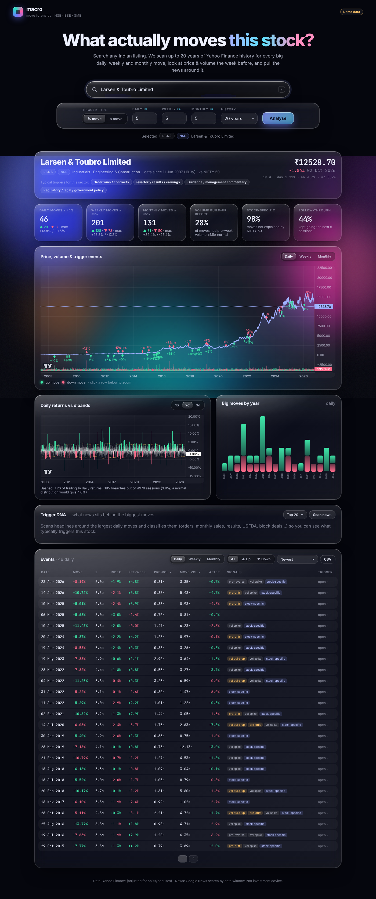

# macro — stock move forensics (NSE · BSE · SME)



Search any Indian listed company, pick its ticker, and the site will:

1. **Pull up to 20 years (or full listed history)** of daily prices and volumes from Yahoo Finance (split/bonus adjusted).
2. **Find every big move.** You choose the frames (any of **daily**, **weekly**, **monthly**) and the trigger type:
   - **% move:** e.g. ±5%.
   - **σ move:** e.g. 2σ, measured against the trailing 1/2/3/5-year standard deviation of that frame's returns. There is no look-ahead.
3. **Look at the week before each move:** price drift, volume build-up vs the 50-day baseline, volume on the move, and follow-through over the next 5 sessions.
4. **Separate market, sector and company drivers.** Each move is compared with NIFTY/SENSEX and with the stock's sector, then labelled market-wide, sector-wide or stock-specific. The sector is the real NIFTY index where Yahoo has daily history (Bank, IT, Pharma); otherwise it is an equal-weighted basket of the industry's listed leaders.
5. **Run the industry trigger engine.** About 45 Indian industry playbooks (banks, NBFCs, IT, cement, EPC, capital goods, autos, steel, chemicals, pharma, FMCG, airlines, real estate, defence, railways…) each list:
   - what makes the industry rally or sell off, and the metrics to watch;
   - its **macro sensitivities**: rates, USD/INR, crude, the dollar, China, US equities, metals, gas, sugar, cotton, gold, VIX, and mid-cap liquidity.

   Each move then gets a **trigger chain** (macro → industry → company → direction). A macro factor counts as an explanation only when it moved at least 1.5σ in the direction that would cause this move for this industry; for example, crude −9% is a tailwind for airlines.
6. **Show a trigger matrix now:** each factor's last-3-month move, and whether that is a tailwind or a headwind for the industry.
7. **Pull news around each move:** company, sector/commodity and market headlines from Google News for that date window. Each headline is tagged with an event type, a **master trigger bucket** (demand, pricing, costs, margins, capacity, competition, regulation, rates, currency, commodities, government spending, orders, credit cycle, liquidity, technology, inventory, balance sheet, M&A, earnings, positioning, macro shock, monsoon, inflation, management) with its horizon tier (structural / cyclical / quarterly / sentiment), and a tone. Company headlines that don't actually name the company are dropped.
8. **Trigger DNA:** for the biggest moves, shows the market/sector/stock split, which episodes and macro factors explained them, and which trigger buckets dominate around rallies vs sell-offs.

Also included: a market-episode calendar (COVID, GFC, demonetisation, elections, Union Budgets, RBI surprises, US tariffs…), a returns-vs-σ-bands chart, CSV export, and shareable links (`/#LT.NS`).

## Tickers

| Market | Yahoo format | Example |
|---|---|---|
| NSE main board | `SYMBOL.NS` | `LT.NS`, `TATAMOTORS.NS` |
| NSE Emerge (SME) | `SYMBOL-SM.NS` / `SYMBOL-ST.NS` | `XYZ-SM.NS` |
| BSE (main + SME) | `CODE.BO` or `SYMBOL.BO` | `500325.BO` |

Type a company name to get the matching tickers with NSE/BSE/SME badges. You can also type a raw symbol in caps or a 6-digit BSE code. Without a suffix, the app tries `.NS`, then `.BO`, then the SME variants.

## Hosting (GitHub Pages)

The site is fully static: all analysis runs in the visitor's browser, so it is hosted on GitHub Pages with no server.

- **Live URL:** https://arhamsaraogi-star.github.io/macro/
- **Demo with synthetic data:** https://arhamsaraogi-star.github.io/macro/?demo=1
- **Deploys:** `.github/workflows/pages.yml` runs the tests and publishes `site/` to the `gh-pages` branch on every push to the default branch. Pages serves that branch.

### Data relay (one-time, ~2 minutes)

Yahoo Finance and Google News don't allow requests from other websites, and the free public CORS relays are all down or paid now (tested in CI). The site therefore reads data through **your own free Cloudflare Worker**:

1. Go to [dash.cloudflare.com](https://dash.cloudflare.com/sign-up/workers-and-pages) → **Workers & Pages** → **Create** → **Create Worker** → name it `macro-relay` → **Deploy**.
2. Click **Edit code**, replace everything with [`relay/worker.js`](relay/worker.js), and click **Deploy**.
3. Copy the `https://macro-relay.<you>.workers.dev` URL and paste it into the site's setup box or **Settings** (gear icon).

The worker only forwards to Yahoo Finance, Google News and NSE's price-history API (used for NSE SME stocks, which Yahoo has no history for), caches responses for an hour, and stays within the free tier (100k requests a day). To make the site work for **every** visitor, put the URL in `site/config.js` (`relay: "https://…"`). To share a ready-to-use link instead, use `https://arhamsaraogi-star.github.io/macro/?relay=<url>`.

`.github/workflows/relay-test.yml` runs the worker locally in CI and fetches real Yahoo and Google News data through it.

Company search doesn't need the relay: it uses the official NSE (main board + SME) and BSE lists, built into the site on each deploy and refreshed weekly.

## Develop

```bash
python3 -m http.server -d site 8000   # open http://localhost:8000 (add ?demo=1 to work offline)
npm test                              # node --test, no dependencies
```

## Structure

```
site/
  index.html, styles.css     liquid-glass UI
  js/app.js                  UI: search, charts, event drawer, trigger DNA, CSV
  js/engine.js               data API used by the UI (live or demo)
  js/analysis.js             period returns, % / σ thresholds, pre-week forensics, summaries
  js/market.js               Yahoo search/chart + Google News through the relay chain
  js/news.js                 headline -> trigger classification, sector playbooks
  js/context.js              macro factors, sector index / peer baskets, market-episode calendar
  js/playbooks.js            industry trigger playbooks, master trigger buckets, macro triggers
  config.js                  site-wide relay URL
scripts/build-tickers.mjs    builds site/data/tickers.json from NSE / BSE lists (CI)
  js/demo.js                 synthetic data for ?demo=1
  vendor/                    TradingView lightweight-charts (Apache-2.0)
relay/worker.js              optional Cloudflare Worker relay
tests/                       node:test unit tests
```

## Caveats

- Yahoo Finance is unofficial. Coverage of SME stocks and very old history can be patchy, and some SME counters only exist on one exchange.
- Yahoo has no daily history for most NIFTY sector indices, so those sectors use a basket of 3–5 listed leaders as a proxy.
- Rates sensitivity uses the US 10-year yield (Yahoo has no Indian G-sec series). Indian rate events are covered through the episode calendar (RBI surprises) and rate headlines.
- SME prices come from NSE's own history API through the relay. NSE prices are unadjusted, so bonuses and splits are adjusted using NSE's adjusted previous close on each ex-date.
- News: Google News blocks many Cloudflare IPs, so the main headline source is GDELT, a free news archive the browser can query directly (2017 onwards, one request every 5 seconds). Google is tried with a short timeout and skipped for 10 minutes after a failure. Every move also has a one-click Google News link for its date window, which opens in your own browser.
- Google News coverage before ~2010 and for small companies is thin. The trigger classification uses keyword rules, so treat it as a lead to read the headlines, not a verdict.
- The market-wide label is mechanical. For heavyweight index stocks (e.g. Reliance, HDFC Bank), the stock itself moves the index, so a "market-wide" label there can be partly self-caused.
- The episode calendar is hand-curated and won't cover every event. Add to `EPISODES` in `site/js/context.js`.
- Not investment advice.
